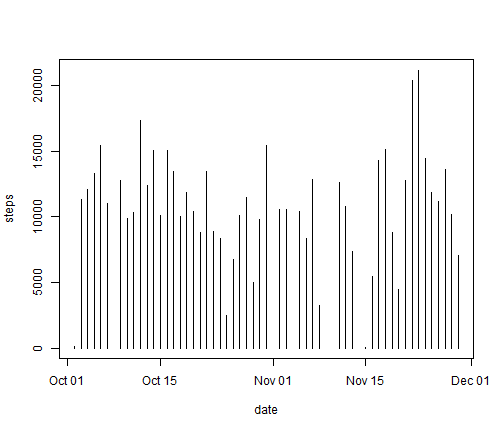
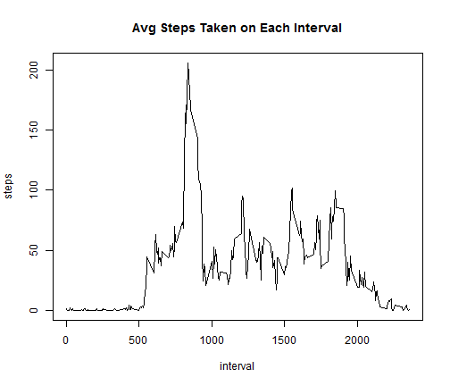
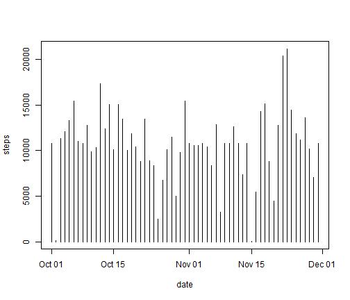
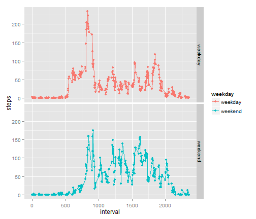

## 1. Loading and preprocessing the data

```r
Sys.setlocale("LC_TIME", "English")

library(ggplot2)
```

```
## Warning: package 'ggplot2' was built under R version 3.1.2
```

```r
activity <- read.csv("./activity.csv",stringsAsFactors=F)

activity$date <- as.Date(activity$date)
```


## 2. What is mean total number of steps taken per day?


### 2.1 Make a histogram of the total number of steps taken each day
 

### 2.2 Calculate and report the mean and median total number of steps taken per day
Mean

```
## [1] 10766
```

Median

```
## [1] 10765
```

## 3. What is the average daily activity pattern?

### 3.1 Make a time series plot (i.e. type = "l") of the 5-minute interval (x-axis) and the average number of steps taken, averaged across all days (y-axis)
 

### 3.2 Which 5-minute interval, on average across all the days in the dataset, contains the maximum number of steps?

```
## [1] 835
```

## 4. Imputing missing values

### 4.1 Calculate and report the total number of missing values in the dataset (i.e. the total number of rows with NAs)
NA values in "steps" column

```
## [1] 2304
```

NA values in "date" column

```
## [1] 0
```

NA values in "interval" column

```
## [1] 0
```

### 4.2 Devise a strategy for filling in all of the missing values in the dataset. The strategy does not need to be sophisticated. For example, you could use the mean/median for that day, or the mean for that 5-minute interval, etc. Create a new dataset that is equal to the original dataset but with the missing data filled in.

We'll go with that one, taking the mean for each of the 5-minute interval and applying it to each NA value.


```r
activityFilled <- activity

for(i in 1:nrow(activityFilled)){
        if(is.na(activityFilled$steps[i])){ 
                tempInterval <- activityFilled[i,3] # 3 being "interval"
                
                activityFilled$steps[i] <- averageInterval$steps[averageInterval$interval==tempInterval]
        }
}
```

### 4.3 Make a histogram of the total number of steps taken each day and Calculate and report the mean and median total number of steps taken per day.  Do these values differ from the estimates from the first part of the assignment? What is the impact of imputing missing data on the estimates of the total daily number of steps?

 

Mean

```
## [1] 10766
```

Median

```
## [1] 10766
```


## 5. Are there differences in activity patterns between weekdays and weekends?

### 5.1 Create a new factor variable in the dataset with two levels -- "weekday" and "weekend" indicating whether a given date is a weekday or weekend day.


```r
head(averaged)
```

```
##   interval  steps weekday
## 1        0 2.3333 weekday
## 2        5 0.4615 weekday
## 3       10 0.1795 weekday
## 4       15 0.2051 weekday
## 5       20 0.1026 weekday
## 6       25 1.5128 weekday
```

### 5.2 Make a panel plot containing a time series plot (i.e. type = "l") of the 5-minute interval (x-axis) and the average number of steps taken, averaged across all weekday days or weekend days (y-axis). The plot should look something like the following, which was created using simulated data

 
